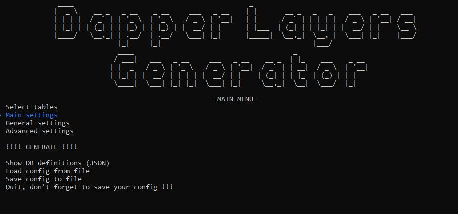
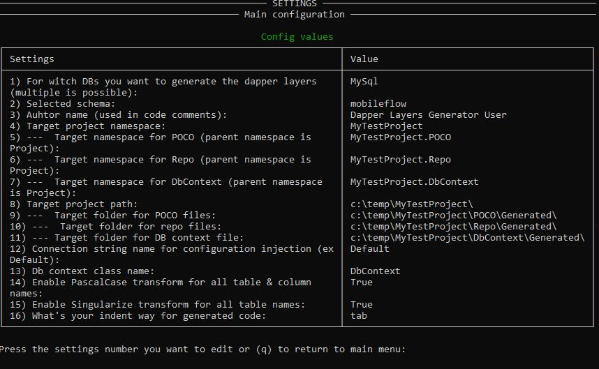
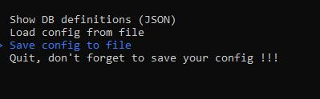
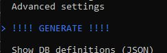

# Fast first run Dapper-Layers-Generator
## Config
Set the mandatory configs in appsettings or environnement or usersecrets
```
{
  "ConnectionStrings": {
    "Default": "Server=localhost;Database=information_schema;Uid=root;Pwd=root;"
  },

  "DB": {
    "Schemas": "testschema",
    "Provider": "MySql"
  }
}
```

- ConnectionStrings:Default => a MySql/Mariadb connection string with read right on information_schema
- DB:Schemas => the schemas/db name you want to read the defintions from to be able to generate your layers code
- DB:Provider => only MySql supported now.


## Run the app


===> Go on "Main settings"



Set at least the following configs
- (3) Author name: your name
- (4) Target project namespace: the main namespace for your generated code
- (8) Target project path: physical path (where you want to generate) => don't forget the last backslash "\\"

Check all the path specified exist on your file system. The generator will not create the folder structure.

Press (q) to go back to the main menu.


## On the main menu, choose "Save"



Complete path/filename.json where you want to save your config.


## Generate !!!!!!


After your first code generation, return, load your config file and test all the available settings in (General settings / adavanced settings). You can go deeper as column config. I let you discover.

# Generated code usage

In your net6 app/asp.net, register the dbcontext :
```
IServiceCollection _services = new ServiceCollection()
    .AddSingleton(_config)
    .AddTransient<IDbContext, DbContextMySql>();
```

and call your new generated dal in your controller/service or app :
```
var clients = await dal.ClientRepo.GetAllAsync();
```

with transaction :
```
using var trans = await dal.OpenTransactionAsync();
int newClientId = await dal.ClientRepo.AddAsync(new Client() { Firstname = "John", Lastname = "Smith", City = "Paris" });
int newFailureId = await dal.FailureRepo.AddAsync(new Failure() { Description="Fail to pass the door", ClientId = newClientId });
dal.CommitTransaction();
```

## If you want to extent the generated code, create a new file and declare a partial class with the same name as the class you want to extent !

Open an issue if you have specific questions or if you detect an issue !

And love for

https://github.com/DapperLib/Dapper

https://github.com/spectreconsole/spectre.console

https://github.com/Humanizr/Humanizer

